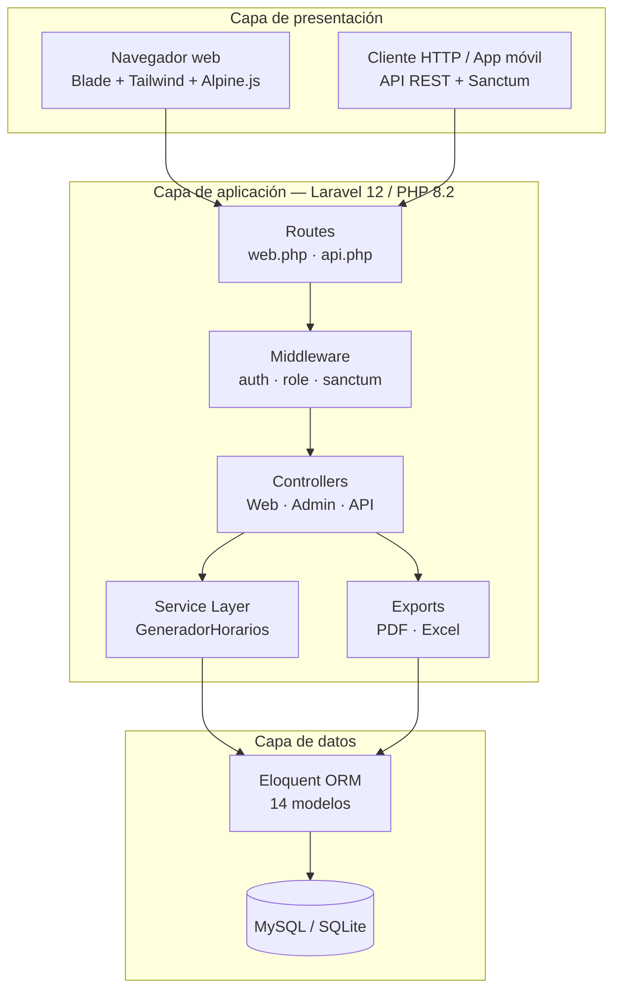
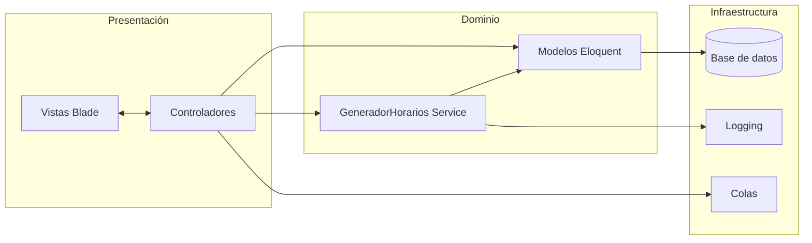
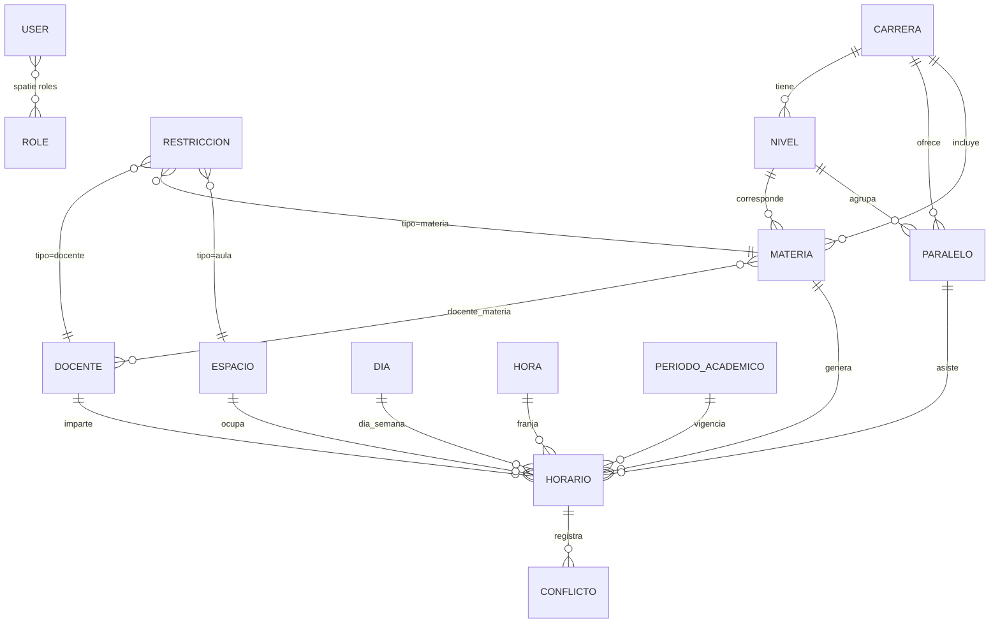
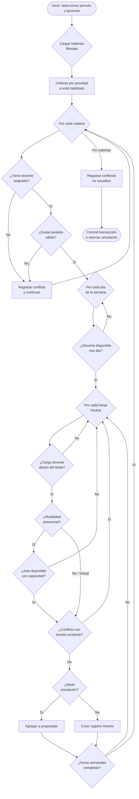
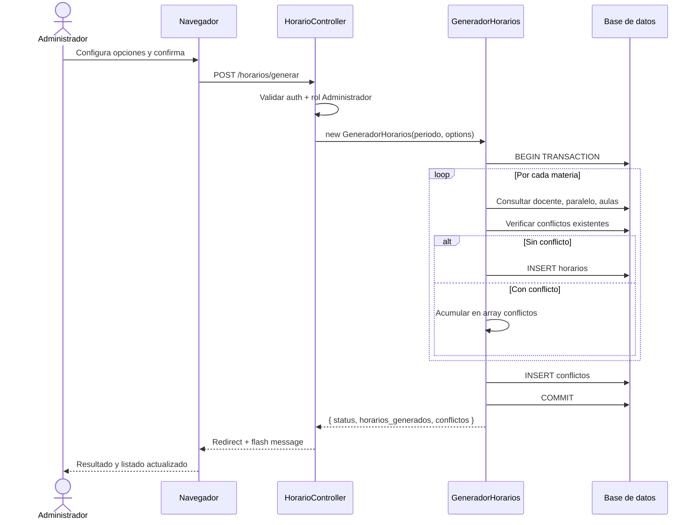
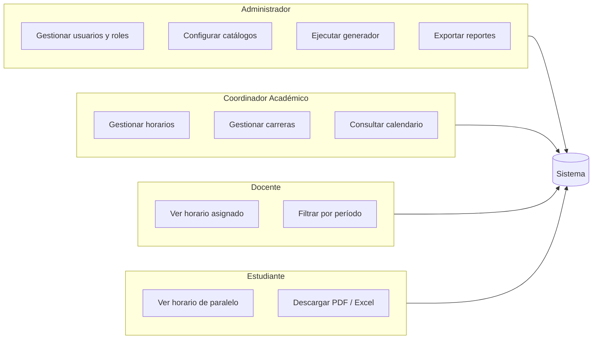
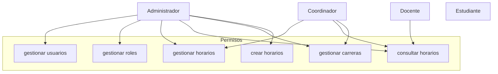
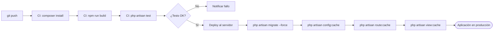

# Generador de Horarios Académicos


Sistema web para la **planificación y gestión automatizada de horarios** en instituciones educativas. Desarrollado con **PHP 8.2** y **Laravel 12**, resuelve la asignación de clases considerando docentes, aulas, paralelos, restricciones y conflictos de disponibilidad.

---

## Índice

- [Descripción del proyecto](#descripción-del-proyecto)
- [Características principales](#características-principales)
- [Vista general del sistema](#vista-general-del-sistema)
- [Stack tecnológico](#stack-tecnológico)
- [Arquitectura de software](#arquitectura-de-software)
- [Modelo de datos](#modelo-de-datos)
- [Flujo de generación de horarios](#flujo-de-generación-de-horarios)
- [Casos de uso por rol](#casos-de-uso-por-rol)
- [Roles y permisos](#roles-y-permisos)
- [API REST](#api-rest)
- [Seguridad](#seguridad)
- [Requisitos del sistema](#requisitos-del-sistema)
- [Instalación](#instalación)
- [Credenciales de demostración](#credenciales-de-demostración)
- [Pruebas](#pruebas)
- [Despliegue en producción](#despliegue-en-producción)
- [Métricas del proyecto](#métricas-del-proyecto)
- [Competencias PHP demostradas](#competencias-php-demostradas-en-este-proyecto)
- [Roadmap](#roadmap)
- [Licencia](#licencia)

---

## Descripción del proyecto

La asignación manual de horarios en universidades e institutos es un proceso repetitivo y propenso a errores: solapamientos de docentes, aulas ocupadas o carga horaria desbalanceada. Este proyecto automatiza ese flujo mediante un motor de generación configurable, con modo de simulación previo a la publicación y exportación de resultados en PDF y Excel.

El sistema cubre el ciclo completo: catálogos académicos → generación inteligente → revisión de conflictos → aprobación de horarios → consulta por rol (administrador, coordinador, docente y estudiante).

### Problema → Solución

| Problema | Solución implementada |
|----------|----------------------|
| Solapamiento de docentes o aulas | Validación de conflictos en tiempo de generación |
| Carga horaria desigual | Balanceo por límites diarios y semanales configurables |
| Cambios de última hora | Modo simulación sin persistir en base de datos |
| Múltiples actores con distintos accesos | RBAC con Spatie Permission y middleware por rol |
| Necesidad de reportes oficiales | Exportación a PDF y Excel con filtros |

---

## Características principales

| Módulo | Descripción |
|--------|-------------|
| **Generación automática** | Asigna materias a franjas horarias respetando horas por semana, disponibilidad de docentes y capacidad de aulas |
| **Detección de conflictos** | Valida solapamientos de docente, paralelo y espacio físico antes de persistir |
| **Simulación** | Permite previsualizar propuestas sin guardar cambios en la base de datos |
| **Restricciones configurables** | Prioridad de materias, días no laborables por docente, límites de carga diaria/semanal y modalidad (presencial / virtual / híbrida) |
| **Gestión académica** | CRUD de carreras, niveles, paralelos, materias, docentes, espacios y períodos académicos |
| **Control de acceso (RBAC)** | Roles y permisos con Spatie Laravel Permission |
| **Calendario interactivo** | Vista semanal de horarios con filtros por carrera, nivel y período |
| **Exportación** | Reportes en PDF (DomPDF) y Excel (Maatwebsite) con filtros |
| **API REST** | Endpoints autenticados con Laravel Sanctum para consulta y generación remota |

---

## Vista general del sistema

Diagrama de capas que muestra cómo interactúan los componentes del sistema:



---

## Stack tecnológico

### Backend (PHP)

| Tecnología | Uso en el proyecto |
|------------|-------------------|
| **PHP 8.2+** | Lenguaje base con tipado y características modernas |
| **Laravel 12** | Framework MVC: routing, ORM, migraciones, colas |
| **Laravel Breeze** | Autenticación y gestión de perfil |
| **Laravel Sanctum** | Tokens de API stateless |
| **Spatie Permission** | Roles y permisos granulares |
| **DomPDF** | Generación de reportes PDF |
| **Maatwebsite Excel** | Exportación de hojas de cálculo |

### Frontend

| Tecnología | Uso en el proyecto |
|------------|-------------------|
| **Blade** | Plantillas del lado del servidor |
| **Tailwind CSS 3** | Diseño responsivo y utilitario |
| **Alpine.js** | Interactividad ligera sin SPA completa |
| **Vite 7** | Bundling y hot reload en desarrollo |

### Calidad y herramientas

| Tecnología | Uso en el proyecto |
|------------|-------------------|
| **Pest PHP** | Pruebas automatizadas de autenticación y perfil |
| **Laravel Pint** | Formateo de código PSR-12 |
| **Laravel Pail** | Visor de logs en tiempo real (dev) |

---

## Arquitectura de software

El proyecto aplica el patrón **MVC de Laravel** con una **capa de servicios** para la lógica de negocio compleja, manteniendo los controladores delgados y el dominio testeable.



### Estructura de directorios

```
generador_horarios/
├── app/
│   ├── Http/
│   │   ├── Controllers/
│   │   │   ├── Admin/          # Usuarios, roles, permisos, generador
│   │   │   ├── Api/            # Endpoints REST (Sanctum)
│   │   │   └── Auth/           # Login, registro, verificación
│   │   └── Requests/           # Form Requests con validación
│   ├── Services/
│   │   └── GeneradorHorarios.php   # Motor de asignación de horarios
│   ├── Models/                 # 14 entidades Eloquent
│   └── Exports/                # Clases Maatwebsite Excel
├── database/
│   ├── migrations/             # Esquema versionado (15+ tablas)
│   └── seeders/                # Datos demo y roles
├── resources/views/            # Vistas Blade por módulo
├── routes/
│   ├── web.php                 # Rutas con auth + middleware role
│   └── api.php                 # API REST protegida
└── tests/                      # Suite Pest (auth, perfil)
```

### Patrones de diseño aplicados

| Patrón | Implementación |
|--------|----------------|
| **Service Layer** | `GeneradorHorarios` encapsula el algoritmo de asignación |
| **Repository implícito** | Eloquent ORM como capa de acceso a datos |
| **Middleware Chain** | Autenticación → autorización por rol → controlador |
| **Form Request** | Validación desacoplada en clases dedicadas |
| **Transaction Script** | `DB::beginTransaction()` / `commit()` en generación masiva |

---

## Modelo de datos

### Diagrama entidad-relación



### Entidades principales

| Entidad | Descripción | Relaciones clave |
|---------|-------------|------------------|
| `Carrera` | Programa académico (ej. Ingeniería en Sistemas) | → Niveles, Paralelos, Materias |
| `Materia` | Asignatura con créditos y tipo | → Carrera, Nivel, Docentes (N:M) |
| `Docente` | Profesor con disponibilidad y restricciones | → Materias, Horarios |
| `Espacio` | Aula o laboratorio con capacidad | → Horarios |
| `Horario` | Registro de una clase en día/hora/período | → Materia, Docente, Espacio, Paralelo |
| `Restriccion` | Regla clave-valor por entidad | Polimórfica (docente, materia, aula) |
| `Conflicto` | Incidencia detectada en generación | → Horario (opcional) |
| `PeriodoAcademico` | Ciclo lectivo con fechas de vigencia | → Horarios |

---

## Flujo de generación de horarios

### Diagrama de flujo del algoritmo



### Diagrama de secuencia — generación vía web



### Opciones configurables del motor

| Opción | Tipo | Descripción |
|--------|------|-------------|
| `carreras` | `int[]` | Filtrar materias por carrera |
| `niveles` | `int[]` | Filtrar por nivel académico |
| `paralelos` | `int[]` | Limitar a paralelos específicos |
| `dias` | `int[]` | Días de la semana a considerar |
| `hora_desde` / `hora_hasta` | `int` | Rango de franjas horarias |
| `validar_conflictos` | `bool` | Activar detección de solapamientos |
| `balancear_carga` | `bool` | Respetar límites diarios/semanales del docente |
| `priorizar_materias` | `bool` | Ordenar por prioridad y horas semanales |
| `simular` | `bool` | Modo preview sin persistir |

---

## Casos de uso por rol



---

## Roles y permisos

| Rol | Permisos destacados | Rutas principales |
|-----|---------------------|-------------------|
| **Administrador** | Acceso total: usuarios, roles, catálogos, generador y exportaciones | `/admin/*`, `/horarios/generador` |
| **Coordinador Académico** | Gestión de horarios, carreras y consulta | `/horarios`, `/carreras` |
| **Docente** | Consulta de horarios asignados | `/horarios/calendario` |
| **Estudiante** | Consulta y descarga de su horario | `/horarios/estudiante` |

### Matriz de permisos



---

## API REST

Endpoints protegidos con token Sanctum (`Authorization: Bearer {token}`).

| Método | Ruta | Rol | Descripción |
|--------|------|-----|-------------|
| `GET` | `/api/user` | Autenticado | Datos del usuario actual |
| `POST` | `/api/generar-horarios` | Administrador | Ejecuta el motor de generación |
| `GET` | `/api/horarios` | Autenticado | Lista horarios (`?periodo_id=1`) |
| `GET` | `/api/conflictos` | Autenticado | Consulta conflictos registrados |

### Ejemplo de petición

```bash
# Obtener token (login vía Sanctum / sesión según configuración)
curl -X POST http://localhost:8000/api/generar-horarios \
  -H "Authorization: Bearer {token}" \
  -H "Content-Type: application/json" \
  -H "Accept: application/json" \
  -d '{
    "periodo_id": 1,
    "validar_conflictos": true,
    "balancear_carga": true,
    "priorizar_materias": true
  }'
```

### Respuesta esperada

```json
{
  "status": "ok",
  "horarios_generados": 42,
  "conflictos": 3
}
```

---

## Seguridad

| Medida | Detalle |
|--------|---------|
| **Autenticación** | Laravel Breeze con sesiones seguras y hash bcrypt de contraseñas |
| **Autorización** | Middleware `role:` de Spatie + políticas por ruta |
| **API** | Laravel Sanctum con tokens de acceso personal |
| **CSRF** | Protección en formularios web vía `@csrf` |
| **Validación** | Form Requests y reglas de validación en controladores |
| **SQL Injection** | Consultas parametrizadas mediante Eloquent / Query Builder |
| **Transacciones** | Rollback automático ante errores en generación masiva |

---

## Requisitos del sistema

| Componente | Versión mínima |
|------------|----------------|
| PHP | 8.2+ |
| Extensiones PHP | BCMath, Ctype, Fileinfo, JSON, Mbstring, OpenSSL, PDO, Tokenizer, XML |
| Composer | 2.x |
| Node.js | 18+ |
| npm | 9+ |
| Base de datos | MySQL 8+ / MariaDB 10+ / SQLite 3 |

---

## Instalación

### 1. Clonar el repositorio

```bash
git clone <url-del-repositorio> generador_horarios
cd generador_horarios
```

### 2. Instalar dependencias

```bash
composer install
npm install
```

### 3. Configurar el entorno

Crear el archivo `.env` en la raíz del proyecto (o copiarlo desde `.env.example` si está disponible) y generar la clave de aplicación:

```bash
php artisan key:generate
```

Configurar la conexión a base de datos en `.env`. Ejemplo con MySQL:

```env
APP_NAME="Generador de Horarios"
APP_ENV=local
APP_DEBUG=true
APP_URL=http://localhost:8000

DB_CONNECTION=mysql
DB_HOST=127.0.0.1
DB_PORT=3306
DB_DATABASE=generador_horarios
DB_USERNAME=root
DB_PASSWORD=
```

### 4. Preparar la base de datos

```bash
php artisan migrate --seed
```

El seeder carga días, franjas horarias, carreras de ejemplo, materias, docentes, espacios, un período académico y usuarios con roles predefinidos.

### 5. Compilar assets y ejecutar

```bash
npm run build
php artisan serve
```

Para desarrollo con recarga en caliente:

```bash
composer dev
```

Este comando levanta en paralelo el servidor PHP, la cola de trabajos, el visor de logs y Vite.

La aplicación estará disponible en `http://localhost:8000`.

---

## Credenciales de demostración

Tras ejecutar los seeders, puede iniciar sesión con cualquiera de estos usuarios (contraseña: `password`):

| Rol | Correo |
|-----|--------|
| Administrador | `admin@example.com` |
| Coordinador Académico | `coordinador@example.com` |
| Docente | `docente@example.com` |
| Estudiante | `estudiante@example.com` |

---

## Pruebas

```bash
composer test
# o directamente:
php artisan test
```

### Cobertura actual

| Área | Archivos de prueba |
|------|-------------------|
| Autenticación | Login, registro, verificación de email, reset de contraseña |
| Perfil | Actualización y eliminación de cuenta |
| Framework | Tests base de Laravel con Pest PHP |

---

## Despliegue en producción

### Pipeline recomendado



### Checklist de producción

```bash
# Optimizaciones Laravel
php artisan config:cache
php artisan route:cache
php artisan view:cache
php artisan event:cache

# Assets compilados
npm run build

# Variables de entorno
APP_ENV=production
APP_DEBUG=false
```

| Variable | Valor recomendado |
|----------|-------------------|
| `APP_ENV` | `production` |
| `APP_DEBUG` | `false` |
| `SESSION_DRIVER` | `database` o `redis` |
| `QUEUE_CONNECTION` | `database` o `redis` |
| `LOG_CHANNEL` | `daily` |

### Servidor web

Configurar el **document root** apuntando a la carpeta `public/`:

```nginx
server {
    listen 80;
    server_name horarios.ejemplo.com;
    root /var/www/generador_horarios/public;

    index index.php;

    location / {
        try_files $uri $uri/ /index.php?$query_string;
    }

    location ~ \.php$ {
        fastcgi_pass unix:/var/run/php/php8.2-fpm.sock;
        fastcgi_param SCRIPT_FILENAME $realpath_root$fastcgi_script_name;
        include fastcgi_params;
    }
}
```

---

## Métricas del proyecto

| Métrica | Valor aproximado |
|---------|------------------|
| Modelos Eloquent | 14 |
| Controladores | 20+ |
| Migraciones | 15+ |
| Vistas Blade | 50+ |
| Roles del sistema | 4 |
| Permisos definidos | 6 |
| Paquetes Composer (prod) | 6 |
| Tests automatizados | 10+ |

---

## Competencias PHP demostradas en este proyecto

- Desarrollo backend con **Laravel 12** siguiendo convenciones del framework y estándares PSR
- Diseño de **esquemas relacionales** con migraciones, seeders y relaciones Eloquent (1:N, N:M, polimórficas)
- Implementación de **lógica de negocio** en capa de servicios reutilizable y testeable
- **Autenticación y autorización** con Breeze, Sanctum y RBAC (Spatie)
- **API REST** con middleware, validación JSON y respuestas estructuradas
- **Exportación de documentos** (PDF/Excel) desde PHP sin dependencias de frontend
- **Transacciones de base de datos** para operaciones atómicas de generación masiva
- **Logging estructurado** para trazabilidad del motor de horarios
- **Pruebas automatizadas** con Pest PHP
- Integración **PHP + JavaScript** mediante Vite, Blade y Alpine.js

---

## Roadmap

Mejoras planificadas que demuestran visión de producto y crecimiento técnico:

- [ ] Tests unitarios del servicio `GeneradorHorarios`
- [ ] Notificaciones por email al publicar horarios
- [ ] Historial de versiones de horarios por período
- [ ] Dashboard con métricas de ocupación de aulas y carga docente
- [ ] Importación masiva de materias y docentes vía Excel
- [ ] Documentación OpenAPI (Swagger) de la API REST
- [ ] Docker Compose para entorno de desarrollo reproducible

---

## Licencia

Este proyecto es software de código abierto bajo la licencia [MIT](https://opensource.org/licenses/MIT).
